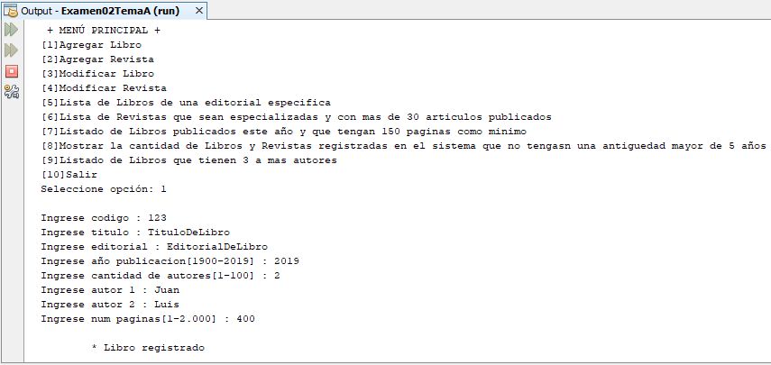

# Sistema de control de escritos
Sistema sobre una Librería con herencia múltiple donde se puede registrar un libro, registrar una revista, modificar un libro, modificar una revista, mostrar los libros de una editorial especifica, listar las revistas que sean especializadas y con más de 30 artículos publicados, listar los libros publicados este año y que tengan 150 paginas como mínimo, mostrar las cantidad de libros y revistas registradas que no tengan una antigüedad mayor de 5 años y un listado de libros que tienen 3 a más autores, **23/12/19**.

<strong>Imagen:</strong> Menú principal - Agregar Libro.

